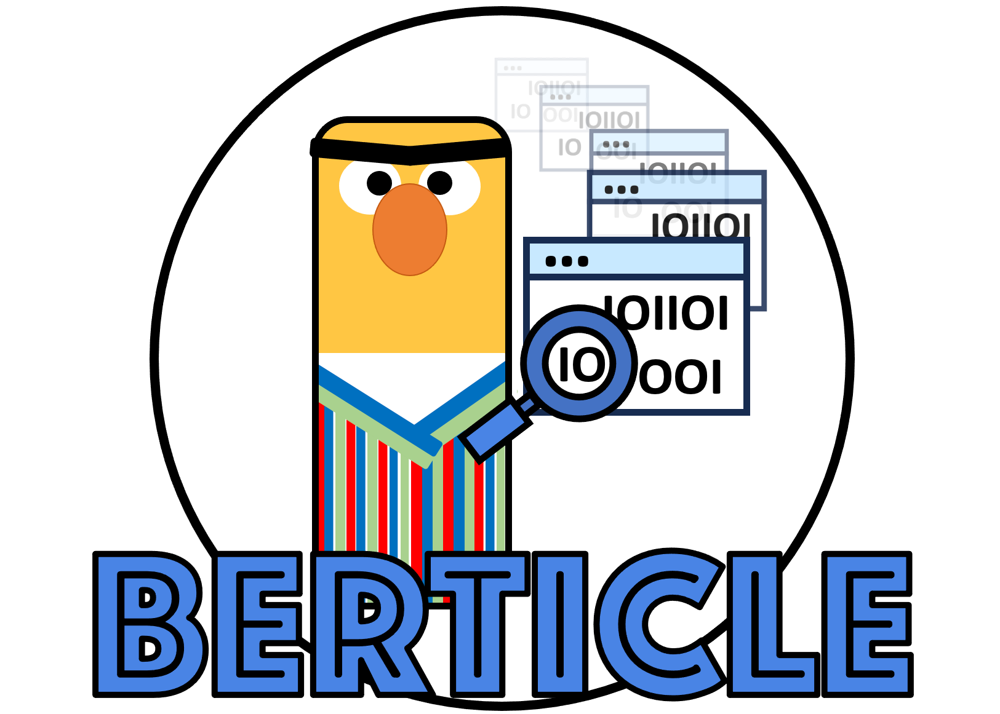
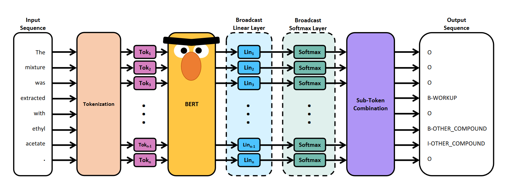
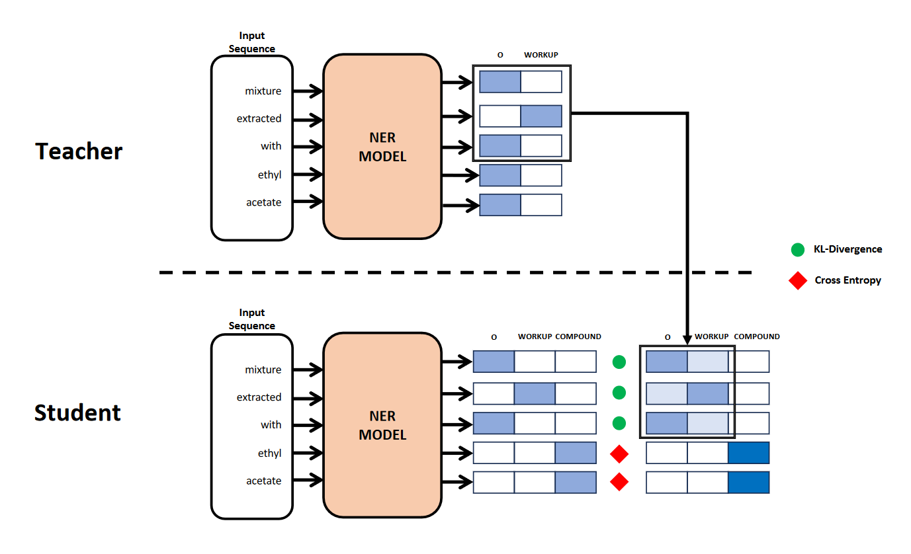
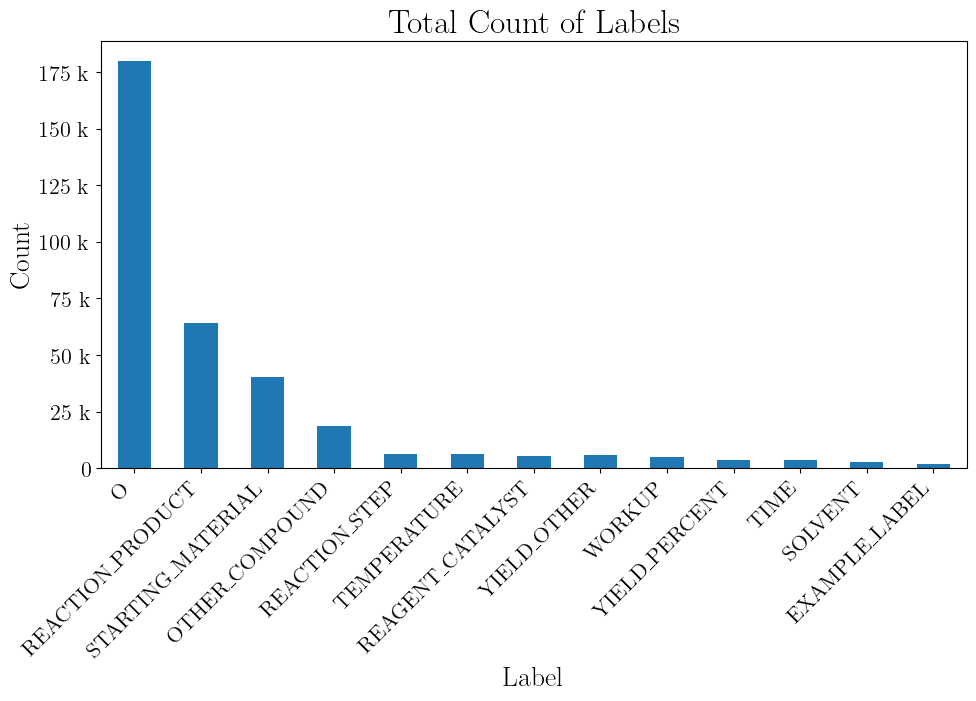

# BERTICLE

<br><br><br><br>
The ChEMU lab series is an annual competition run by Cheminformatics Elsevier Melbourne University lab. The ChEMU shared NER task seeks to identify chemical compounds along with their roles in a reaction.

This model is a continual learning BERT model that performs class-incremental NER on the ChEMU dataset.

**BERT-I**nspired **C**ontinual **L**earning for **E**ntity-recognition (**BERTICLE**)

## Model

The model performs student-teacher continual learning. A teacher model is first
trained to perform NER on a set of entity classes. In a series of steps that follow, a student model then learns new 
classes while trying to replicate the predictions of the teacher on the old classes. At the end of each step, the
student model becomes the new teacher, takes on a new student (a clone of itself), and repeats the process. 




## Installation and Usage Instructions
to run the code, create a virtual environment in python 3.11+. 

ensure cuda is installed. this can be checked with:
```bash
nvcc --version
```

Installation instructions can be found on the [Nvidia site](https://docs.nvidia.com/cuda/cuda-installation-guide-linux/index.html)

Install the version of pytorch suitable for your cuda version. Installation instructions and version information can be found on the [pytorch site](https://pytorch.org/get-started/locally/).

Before cloning the repository, ensure you have `git` installed:

```bash
git --version
```
If not installed, [install Git here](https://git-scm.com/book/en/v2/Getting-Started-Installing-Git).

In your terminal, navigate to where you'd like the repository. Clone with:

```bash
git clone https://github.com/cutlerci/Baseline-NER-System.git
```
Navigate into the repository's directory:

```bash
cd Baseline-NER-System
```

Run the following commands to install the requirements:

```bash
pip install lightning  
pip install -r requirements.txt
```

This training code was made to use wandb to track performance. In python, run: 

```python
wandb login
```

When prompted, enter your API key (or ask us for one!)

Instructions for getting an API key from wandb can be found on the [wandb site.](https://docs.wandb.ai/quickstart) 

 To run the model, run "older_gpu_trainer_wandb.py" with:

```python
python older_gpu_trainer_wandb.py
```

This file imports the model and dataset classes from the other files in the repository. 
Batch size can be adjusted by changing the batch_size variable in older_gpu_trainer_wandb.py 


## Data 

### Counts by Tag:
| Label                 | Count  | | Label                 | Count  |
|-----------------------|--------|-|-----------------------|--------|
| O                     | 179973 | | REAGENT_CATALYST      | 5517   |
| REACTION_PRODUCT      | 64307  | | WORKUP                | 5043   |
| STARTING_MATERIAL     | 40262  | | YIELD_PERCENT         | 3763   |
| OTHER_COMPOUND        | 18568  | | TIME                  | 3690   |
| REACTION_STEP         | 6213   | | SOLVENT               | 2511   |
| TEMPERATURE           | 6208   | | EXAMPLE_LABEL         | 1686   |
| YIELD_OTHER           | 5614   | |                       |        |


### Counts by Tag as Bar Graph:



## References: 
J. Devlin, M.-W. Chang, K. Lee, and K. Toutanova, “Bert: Pre-training of deep bidirectional transformers for language understanding,” arXiv preprint arXiv:1810.04805, 2018.

D. Mahendran, C. Tang, and B. T. McInnes, “NLPatVCU: CLEF 2022 ChEMU Shared Task System,” 2022.


